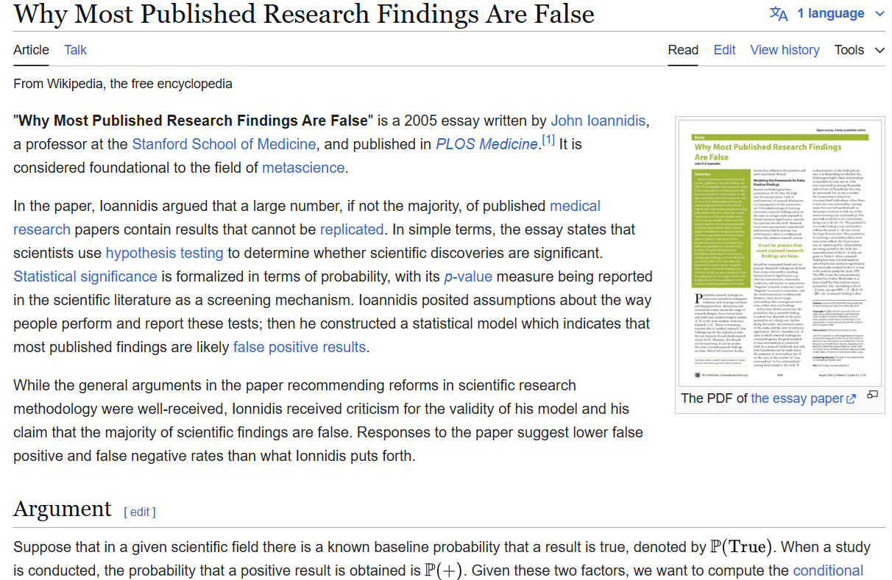
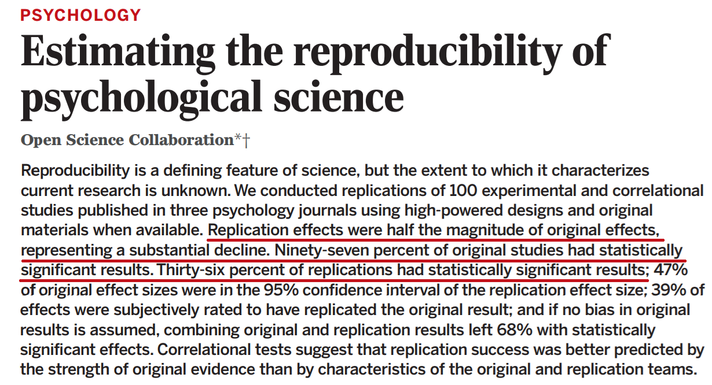
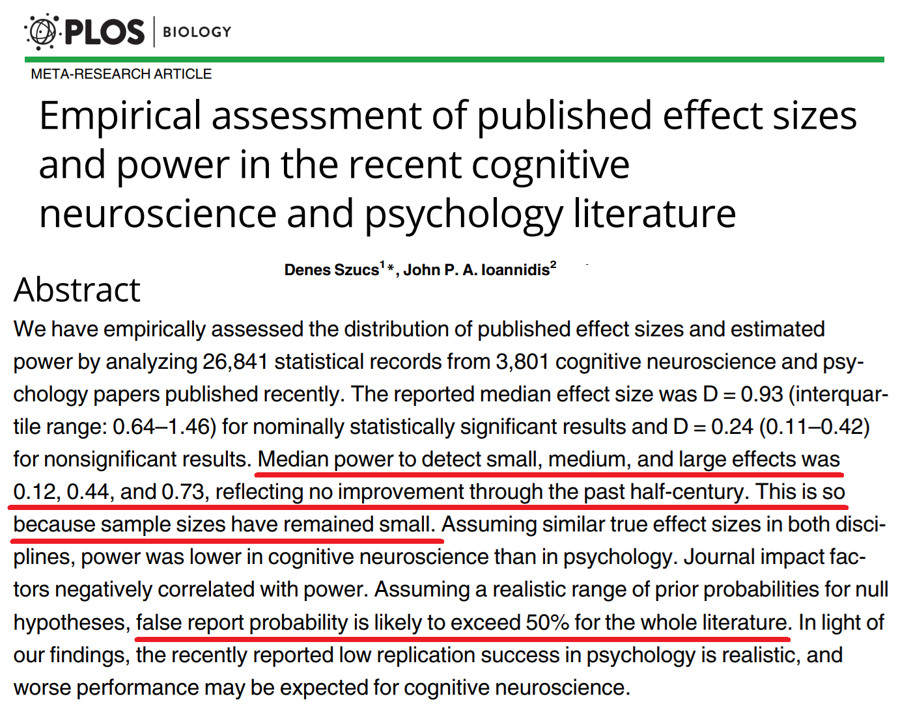
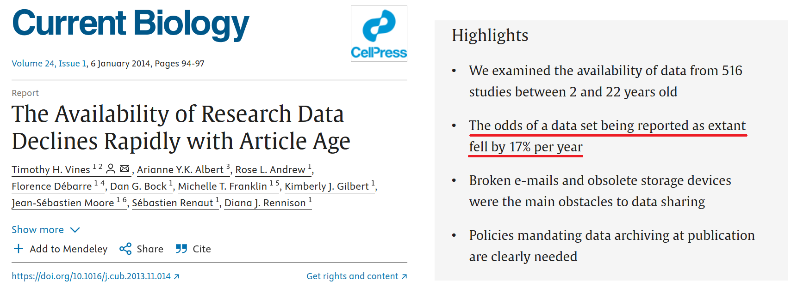
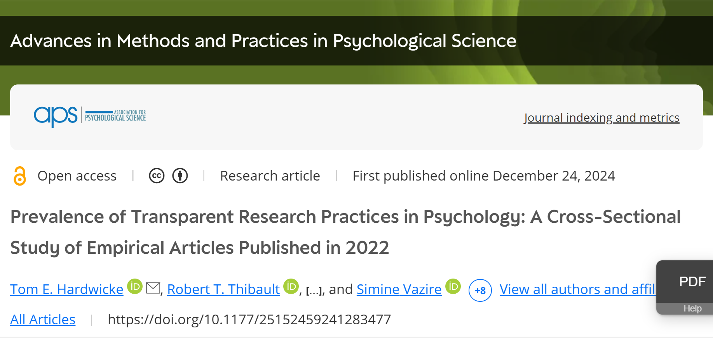
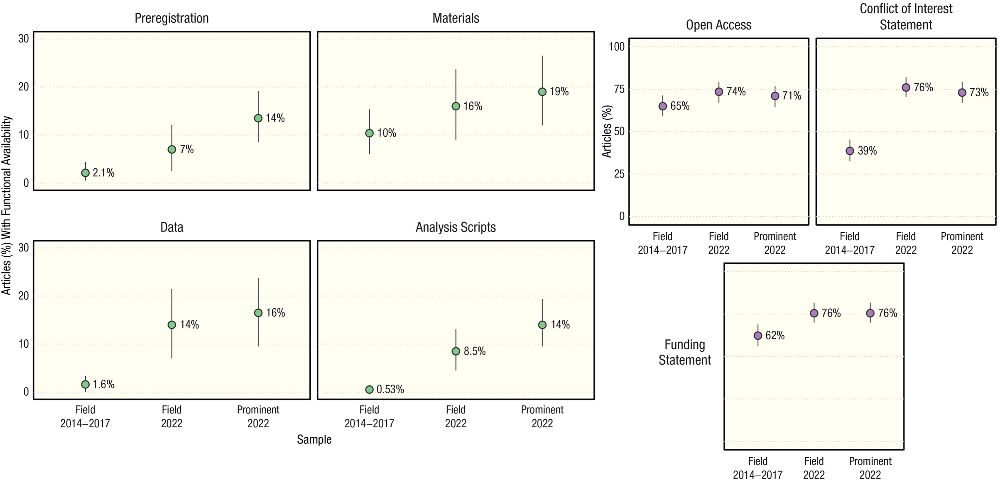
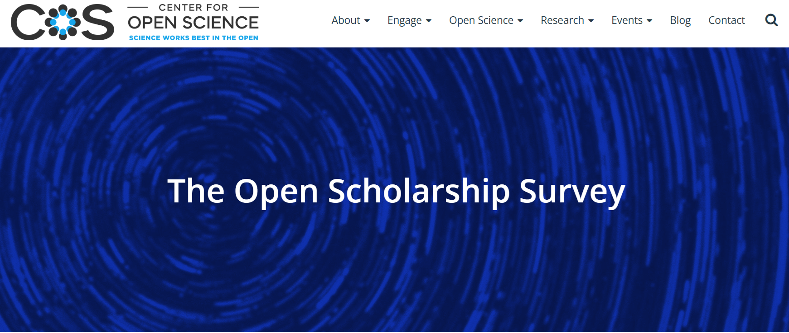
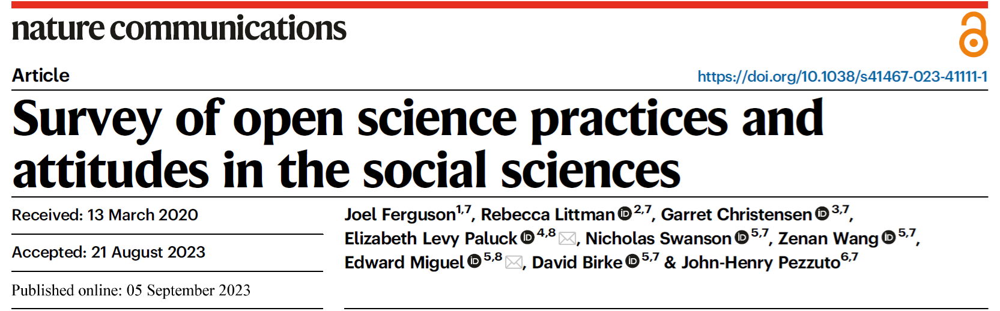

## 20 anni di sventura?

<div style="text-align: center;">
<a href="https://en.wikipedia.org/wiki/Why_Most_Published_Research_Findings_Are_False" target=_blank></a>
</div>

## 20 anni di sventura?

- Bassa potenza statistica + bassa probabilità di baseline = difficile distinguere veri positivi da falsi positivi

Combinato con (da <a href="https://en.wikipedia.org/wiki/Why_Most_Published_Research_Findings_Are_False#Causes_of_high_false_positive_rate" target=_blank>Wikipedia</a>): <em>

- Solo, siloed investigator limited to small sample sizes
- **No preregistration** of hypotheses being tested
- **Post-hoc cherry picking** of hypotheses with best P values
- Only requiring P < .05
- No replication
- **No data sharing**
</em>

## Science - OSC 2015

<div style="text-align: center;">
<a href="https://www.science.org/doi/pdf/10.1126/science.aac4716" target=_blank></a>
</div>

## Szucs and Ioannidis (2017)

<div style="text-align: center;">
<a href="https://journals.plos.org/plosbiology/article/file?id=10.1371/journal.pbio.2000797&type=printable" target=_blank></a>
</div>

## Gelman, la piuma e il canguro

::: columns
::: {.column width="55%"}
<a href="https://statmodeling.stat.columbia.edu/2015/04/21/feather-bathroom-scale-kangaroo/" target=_blank></a>
:::
::: {.column width="45%"}
<em>"(...) My best analogy is that they are trying to use a bathroom scale to weigh a feather—and the feather is resting loosely in the pouch of a kangaroo that is vigorously jumping up and down"</em>
:::
:::

## Gelman, la piuma e il canguro
<div style="font-size:25px;">
*"Top journals in psychology routinely publish ridiculous, scientifically implausible claims, justified based on 'p < 0.05'. Recent examples of such silliness include claimed evidence of extra-sensory perception (published in the Journal of Personality and Social Psychology), claims that women at certain stages of their menstrual cycle were three times more likely to wear red or pink clothing and 20 percentage points more likely to vote for the Democratic or Republican candidate for president (published in Psychological Science), and a claim that people react differently to hurricanes with male and female names (published in the Proceedings of the National Academy of Sciences)."*
</div>
<div style="font-size:20px;">

> Gelman, A. (2015). Working through some issues. *Royal Statistical Society, 12*(3), 33-35. <a href="https://doi.org/10.1111/j.1740-9713.2015.00828.x" target=_blank>https://doi.org/10.1111/j.1740-9713.2015.00828.x</a>

<div style="text-align: center;">*See also:*</div>

Button, K. S., Ioannidis, J. P. A., Mokrysz, C., Nosek, B., Flint, J., Robinson, E. S. J. and Munafo, M. R. (2013). **Power failure: Why small sample size undermines the reliability of neuroscience**. *Nature Reviews Neuroscience, 14*(5), 365-376. <a href="https://doi.org/10.1038/nrn3475" target=_blank>https://doi.org/10.1038/nrn3475</a>

Simmons, J., Nelson, L. and Simonsohn, U. (2011) **False-positive psychology: Undisclosed flexibility in data collection and analysis allows presenting anything as significant**. *Psychological Science, 22*(11), 1359–1366. <a href="https://doi.org/10.1177/0956797611417632" target=_blank>https://doi.org/10.1177/0956797611417632</a>
</div>

## Che fare?

- (Valore *null results*, studi di replica, review & meta-analisi, ecc.)
- Large-scale collaborations: International **multi-lab** studies <sup>[<a href="https://doi.org/10.1037/cap0000216" target=_blank>1</a>, <a href="https://journals.sagepub.com/doi/10.1177/2515245918810225" target=_blank>2</a>, <a href="https://royalsocietypublishing.org/doi/full/10.1098/rsos.230235" target=_blank>3</a>]</sup>
- Appropriata ***power analysis*** a priori, giustificare *sample size* per le ipotesi (quali?) <sup>[<a href="https://online.ucpress.edu/collabra/article/8/1/33267/120491/Sample-Size-Justification" target=_blank>4</a>]</sup>
- **Pre-registration** e *registered reports*: trasparenza nel distinguere tra ipotesi e metodi pensati prima vs pensati dopo <sup>[<a href="https://www.tandfonline.com/doi/pdf/10.1080/2833373X.2024.2376046" target=_blank>5</a>]</sup>
- ***Data availability***: reperimento **facile** dei dati grezzi quantitativi anonimizzati per 1) rianalisi secondarie (*multiverse*?); 2) meta-analisi
- ***Code availability*** per 1) totale chiarezza sui metodi; 2) immenso valore educativo, diffusione conoscenza; 3) test *error checking* 😬, garanzia riproducibilità risultati

## Noticina sulla *code availability*

<div style="text-align: center;">
*"Data will be available from the corresponding author upon reasonable request"* 

😂
</div>

<div style="text-align: center;">
<a href="https://www.sciencedirect.com/science/article/pii/S0960982213014000" target=_blank></a>
</div>

## Policy reforms?

- Ripetute indicazioni che pratiche Open Science e trasparenza dovrebbero essere valorizzate nel reclutamento, perfino su espressione della <a href="https://euraxess.ec.europa.eu/sites/default/files/policy_library/os-rewards-wgreport-final_integrated_0.pdf" target=_blank>Commissione Europea</a><sup>[<a href="https://euraxess.ec.europa.eu/sites/default/files/policy_library/os-rewards-wgreport-final_integrated_0.pdf" target=_blank>1</a>, <a href="https://pmc.ncbi.nlm.nih.gov/articles/PMC6195839/" target=_blank>2</a>, <a href="https://www.nicebread.de/open-science-hiring-practices/?utm_source=chatgpt.com" target=_blank>3</a>, <a href="https://www.euroscientist.com/jean-claude-burgelman-the-new-open-science-paradigm-requires-fine-tuning/" target=_blank>4</a>]</sup>
- Temi "Open Science" ampiamente presenti al <a href="https://www.ethics.cnr.it/27-e-28-gennaio-2025-1-congresso-nazionale-integrita-nella-ricerca/" target=_blank>1° Congresso CNR su Integrità Ricerca</a> (es. *data transparency* suggerita tra metodi necessari per valutazione di ricerca e ricercatori in un mondo accademico globalizzato e caotico; cf. E. Bucci su AI-fraud)
- VQR in IRIS prevedeva campi "*Open Access*" (almeno AAM obbligata per ricerca finanziata da bandi pubblici) + "*Open Science* (dati FAIR<sup>[<a href="https://openscience.unimib.it/open-research-data/condividi/cosa-sono-i-dati-fair/" target=_blank>5</a>, <a href="https://sba.unibo.it/it/almadl/open-access-e-open-science/dati-della-ricerca-aperti" target=_blank>6</a>]</sup>)"

## *The Times They Are A-Changin'*

<a href="https://journals.sagepub.com/doi/10.1177/25152459241283477" target=_blank></a>

## Hardwicke et al. (2024) results

<div style="text-align: center;">
<a href="https://journals.sagepub.com/doi/10.1177/25152459241283477" target=_blank></a>
</div>

## Opinions on Open Science?

<div style="text-align: center;">
<a href="https://www.cos.io/initiatives/open-scholarship-survey" target=_blank></a>
</div>

## Opinions on Open Science?

<div style="text-align: center;">
<a href="https://www.nature.com/articles/s41467-023-41111-1" target=_blank></a>
</div>

<div style="font-size:18px;">
> ABSTRACT: Open science practices such as posting data or code and pre-registering analyses are increasingly prescribed and debated in the applied sciences, but the actual popularity and lifetime usage of these practices remain unknown. This study provides an assessment of attitudes toward, use of, and perceived norms regarding open science practices from a sample of authors published in top-10 (most-cited) journals and PhD students in top-20 ranked North American departments from four major social science disciplines: economics, political science, psychology, and sociology. We observe largely favorable private attitudes toward widespread lifetime usage (meaning that a researcher has used a particular practice at least once) of open science practices. As of 2020, nearly 90% of scholars had ever used at least one such practice. Support for posting data or code online is higher (88% overall support and nearly at the ceiling in some fields) than support for pre-registration (58% overall). With respect to norms, there is evidence that the scholars in our sample appear to underestimate the use of open science practices in their field. We also document that the reported lifetime prevalence of open science practices increased from 49% in 2010 to 87% a decade later.

</div>

<div style="font-size:24px;">
— see also: <a href="https://www.bitss.org/projects/the-state-of-social-science-3s-survey/" target=_blank>Berkeley Initiative for Transparency in the Social Sciences</a>
</div>

## Pro e Contro?

<div style="font-size:55px;">
• Preregistrazione (e *registered reports*)  

• Open data  

• Open code  
</div>

*Pro* e *contro* (veri e soprattutto presunti) possono essere sia sul piano scientifico che su quello personale (e spesso sono in contrasto tra i due piani) → Abbiamo provato a elencarli <b><a href="https://docs.google.com/document/d/1sEDNJO9Ko1lT0LISj2bUxzybRQC9lLV0iY8MwKNc5TU/edit?tab=t.0" target=_blank>a questo link</a></b>


## Quanta ne stiamo facendo?

```{r, echo=F}
rm(list=ls())
library(ggplot2)
load("plots.RData")
ggPreregistered
```

## Quanta ne stiamo facendo?

```{r, echo=F}
ggPreregisteredProp
```

## Quanta ne stiamo facendo?

```{r, echo=F}
ggOpenData
```

## Quanta ne stiamo facendo?

```{r, echo=F}
ggOpenDataProp
```

## Quanta ne stiamo facendo?

```{r, echo=F}
ggOpenCode
```

## Quanta ne stiamo facendo?

```{r, echo=F}
ggOpenCodeProp
```

## (Buoni) esempi

::: columns
::: {.column width="34%"}
**Pre-registration**

- ...
:::
::: {.column width="33%"}
**Open data**

- ...
:::
::: {.column width="33%"}
**Open code**

- ...
:::
:::

