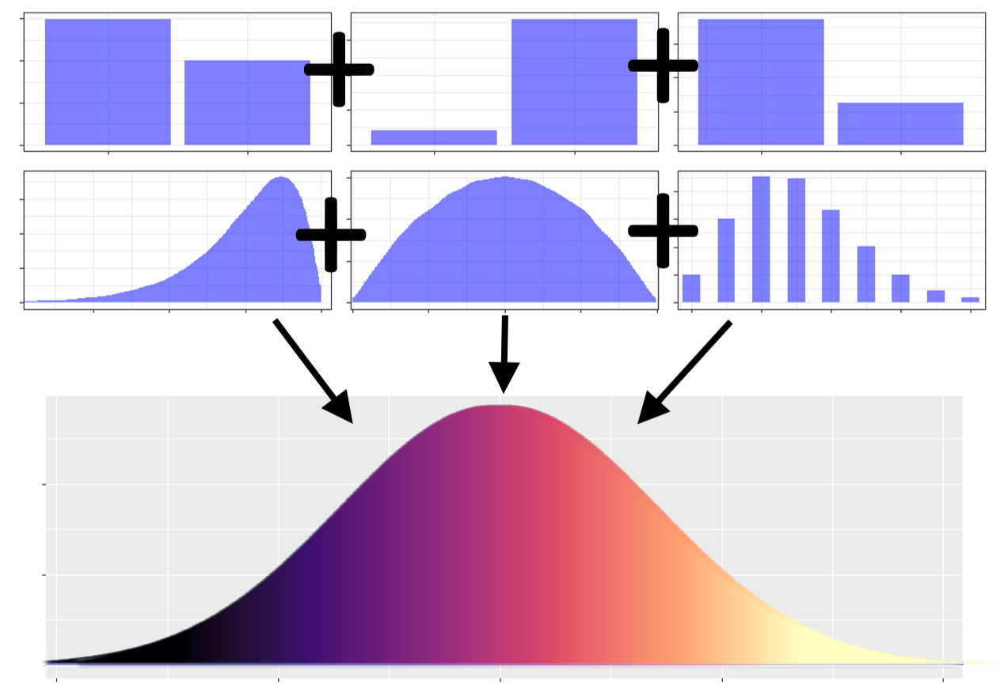

## a typical (mixed-effects) linear model

<b>`fit = lmer(y ~ group + covar + (1|id), data=df)`</b>

Generally, both random effects (above, intercepts) and residuals are taken as normally-distributed:

*random intercepts* ~ $N(0,\tau^2)$

*residuals* ~ $N(0,\sigma^2)$

\

But why <b><i>normally-distributed</i></b>?

## tendency towards "normality"?
::: {.columns}
::: {.column width="50%"}
**underlying normality** of responses (*residuals*) and/or individual differences (*random intercepts*) arise from the **sum of a great number of independent factors/causes** (e.g., environmental, genetic, contextual), which makes a lot of sense in psychology and beyond!
:::
::: {.column width="50%"}
 <figure></figure>
:::
:::

## tendency towards "normality"?
::: {.columns}
::: {.column width="50%"}
this is a **generalization of the Central Limit Theorem (CLT)** to the sum of (many) independent and identically distributed varaibles (*Lindeberg–Lévy CLT*) or even non-identically distributed variables (*Lyapunov CLT*)
:::
::: {.column width="50%"}
 <figure></figure>
:::
:::

## but then, why are so many variables skewed?

in many (most) cases, observed scores are reflective of the underlying dimension of interest; **we do not *directly* observe the dimension of interest**, but scores that generally have:

- a lower bound (e.g., zero for times, errors)

- both a lower and an upper bound (e.g., accuracies, sum scores)

close to bound(s) variability reduces and the distributions become skewed

## TIME
::: {.columns}
::: {.column width="50%"}
```{r, echo=F,message=F,warning=F}
library(ggplot2)
library(scales)
df = data.frame(x = seq(-3.5, 3.5, length.out = 1000), y = NA)
df$y = dnorm(df$x, mean = 0, sd = 1)

ggplot(df, aes(x = x, y = y, fill = x)) +
  geom_col(width = 0.1, color = NA) +
  scale_fill_viridis_c(option="magma",limits=c(-2,2),oob=scales::squish) +
  theme(text=element_blank(),legend.position = "none")
```
:::
::: {.column width="50%"}
```{r, echo=F,message=F,warning=F}
ggplot(df, aes(x = 3^(x/2), y = y, fill = x)) +
  geom_col(width = 0.1, color = NA) +
  scale_fill_viridis_c(option="magma",direction=-1,limits=c(-1.5,3),oob=scales::squish) +
  geom_vline(xintercept=0,linewidth=3.5,linetype=2,color="blue")+
  theme(text=element_blank(),legend.position = "none")
```
:::
:::

while the underlying ability of interest might be normally distributed, observed times cannot be, because they present a lower bound on zero

*IMPORTANT: equal intervals on the right panel do NOT reflect equal interval on the left panel*

## ERRORS
::: {.columns}
::: {.column width="50%"}
```{r, echo=F,message=F,warning=F}
df = data.frame(x = seq(-3.5, 3.5, length.out = 1000), y = NA)
df$y = dnorm(df$x, mean = 0, sd = 1)

ggplot(df, aes(x = x, y = y, fill = x)) +
  geom_col(width = 0.1, color = NA) +
  scale_fill_viridis_c(option="magma",limits=c(-2,2),oob=scales::squish) +
  theme(text=element_blank(),legend.position = "none")
```
:::
::: {.column width="50%"}
```{r, echo=F,message=F,warning=F}
dfPois = data.frame(x=0:10,y=NA)
dfPois$y = dpois(dfPois$x,2.5)
ggplot(dfPois, aes(x = x, y = y, fill = x)) +
  geom_col(width = 0.5, color = "black",size=.8) +
  scale_fill_viridis_c(option="magma",direction=-1,limits=c(0.5,6),oob=scales::squish) +
  geom_vline(xintercept=-.3,linewidth=3.5,linetype=2,color="blue")+
  theme(text=element_blank(),legend.position = "none")
```
:::
:::

the case of error is very similar: a lower bound on zero again exists, with the difference that the observations are discrete (not continuous)

*IMPORTANT: equal intervals on the right panel do NOT reflect equal interval on the left panel*

## ACCURACIES, BOUNDED SUM SCORES
::: {.columns}
::: {.column width="50%"}
```{r, echo=F,message=F,warning=F}
df = data.frame(x = seq(-3.5, 3.5, length.out = 1000), y = NA)
df$y = dnorm(df$x, mean = 0, sd = 1)

ggplot(df, aes(x = x, y = y, fill = x)) +
  geom_col(width = 0.1, color = NA) +
  scale_fill_viridis_c(option="magma",limits=c(-2,2),oob=scales::squish) +
  theme(text=element_blank(),legend.position = "none")
```
:::
::: {.column width="50%"}
```{r, echo=F,message=F,warning=F}
k = 50
dfBin = data.frame(x=0:k,y=NA)
dfBin$y = dlogis(as.numeric(scale(dfBin$x)),1,.5)
ggplot(dfBin, aes(x = x, y = y, fill = x)) +
  geom_col(width = .7, color = NA) +
  scale_fill_viridis_c(option="magma",limits=c(15,50),oob=scales::squish) +
  geom_vline(xintercept=c(-1,k+1),linewidth=3.5,linetype=2,color="blue")+
  theme(text=element_blank(),legend.position = "none")
```
:::
:::
::: {.columns}
::: {.column width="50%"}
```{r, echo=F,message=F,warning=F}
k = 50
dfBin = data.frame(x=0:k,y=NA)
dfBin$y = dlogis(as.numeric(scale(dfBin$x)),-1,.5)
ggplot(dfBin, aes(x = x, y = y, fill = x)) +
  geom_col(width = .7, color = NA) +
  scale_fill_viridis_c(option="magma",limits=c(0,35),oob=scales::squish) +
  geom_vline(xintercept=c(-1,k+1),linewidth=3.5,linetype=2,color="blue")+
  theme(text=element_blank(),legend.position = "none")
```
:::
::: {.column width="50%"}
```{r, echo=F,message=F,warning=F}
k = 50
dfBin = data.frame(x=0:k,y=NA)
dfBin$y = dnorm(as.numeric(scale(dfBin$x)),0,1)
ggplot(dfBin, aes(x = x, y = y, fill = x)) +
  geom_col(width = .7, color = NA) +
  scale_fill_viridis_c(option="magma",limits=c(5,45),oob=scales::squish) +
  geom_vline(xintercept=c(-1,k+1),linewidth=3.5,linetype=2,color="blue")+
  theme(text=element_blank(),legend.position = "none")
```
:::
:::

## TIME: mean vs variance
::: {.columns}
::: {.column width="50%"}
```{r, echo=F,message=F,warning=F}
# viridis_pal(option = "magma")(10)
ggplot() +
  scale_x_continuous(limits=c(-3,4))+
  stat_function(fun=dnorm,args=list(0,1),linewidth=5,col="#451077FF")+
  stat_function(fun=dnorm,args=list(1,1),linewidth=5,col="#F8765CFF")+
  theme(text=element_blank())
```
:::
::: {.column width="50%"}
```{r, echo=F,message=F,warning=F}
ggplot() +
  scale_x_continuous(limits=c(0,10))+
  geom_vline(xintercept=0,linewidth=3.5,linetype=2,color="blue")+
  stat_function(fun=dgamma,args=list(4,1),linewidth=5,col="#451077FF")+
  stat_function(fun=dgamma,args=list(4,2),linewidth=5,col="#F8765CFF")+
  theme(text=element_blank())
```
:::
:::

- <b>*true underlying (maybe normally-distributed) scores*</b>: experimental condition (or group) <em><b><span style="color:#451077FF;">purple</span></b></em> is more difficult (less able) than experimental condition (group) <em><b><span style="color:#F8765CFF;">orange</span></b></em> there is only a shift in mean value;
- <b>*observed scores*</b>: as *mean* increases, *variance* also increases
- the <b>LINK FUNCTION</b> links the *observed scores* to the *true underlying scores*; in the case above it is *logarithm* (`link="log"`; typical for times)

## `link = "probit"`
::: {.columns}
::: {.column width="50%"}
```{r, echo=F,message=F,warning=F}
# viridis_pal(option = "magma")(12)
ggplot() +
  scale_x_continuous(limits=c(-5,4.5))+
  stat_function(fun=dnorm,args=list(-2,1),linewidth=5,col="#120D32FF")+
  stat_function(fun=dnorm,args=list(-1.3,1),linewidth=5,col="#451077FF")+
  stat_function(fun=dnorm,args=list(-0.6,1),linewidth=5,col="#A3307EFF")+
  stat_function(fun=dnorm,args=list(0.1,1),linewidth=5,col="#E95562FF")+
  stat_function(fun=dnorm,args=list(0.8,1),linewidth=5,col="#F97C5DFF")+
  stat_function(fun=dnorm,args=list(1.5,1),linewidth=5,col="#FEC98DFF")+
  theme(text=element_blank())
```
:::
::: {.column width="50%"}
```{r, echo=F,message=F,warning=F}
inverse_probit_trans = function() {
  trans_new("inverse_probit", 
            transform = function(x) pnorm(x), 
            inverse = function(x) qnorm(x))
}
ggplot() +
  geom_vline(xintercept=c(-3,4),linewidth=4,linetype=2,color="blue")+
  scale_x_continuous(limits=c(-3,4), trans = inverse_probit_trans())+
  stat_function(fun=dnorm,args=list(-1.0,.6),linewidth=5,col="#120D32FF")+
  stat_function(fun=dnorm,args=list(-0.6,.6),linewidth=5,col="#451077FF")+
  stat_function(fun=dnorm,args=list(-0.2,.6),linewidth=5,col="#A3307EFF")+
  stat_function(fun=dnorm,args=list(0.2,.6),linewidth=5,col="#E95562FF")+
  stat_function(fun=dnorm,args=list(0.6,.6),linewidth=5,col="#F97C5DFF")+
  stat_function(fun=dnorm,args=list(1.0,.6),linewidth=5,col="#FEC98DFF")+
  theme(text=element_blank())
```
:::
:::

this is very typical of distributions arising from binomial processes (e.g., accuracies) but also ordinal processes (e.g., sum scores of scales, questionnaires)

*IMPORTANT: once again, note that equal intervals on the right panel do NOT reflect equal interval on the left panel*

## `link = "probit"`

In binomial and ordinal distributions, individual differences (random intercepts) may be normally distributed, but the residuals are not!

Accuracies or sum scores computed on 5, 10, 50 items must consider that the underlying data-generating process is binomial. <b>Only with *infinite* items/trials the error term (residuals) is normally distributed</b>.

This is the main reason why we (should) use `family=binomial` instead of `family=gaussian` when dealing with accuracies...


## Differences between differences

In all previous cases, we noted that ***equal differences on the observed scores do NOT reflect equal differences on the underlying ability/trait***. 

➜ This **may have devastating consequences when testing interactions**, because interactions can be seen as tests of whether there are *differences between differences* (i.e., whether a difference is equal to another difference)

Luckily, using the correct link function solves any problem. *(But what is the correct link function?)*


<!-- --------------------------------------------------------------------- -->


